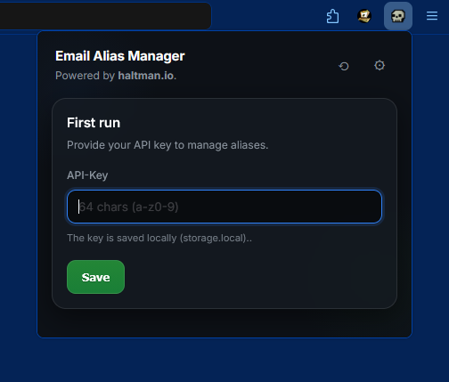
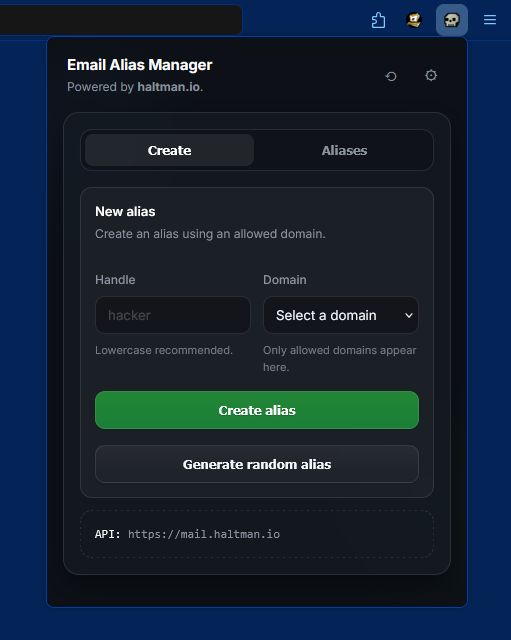
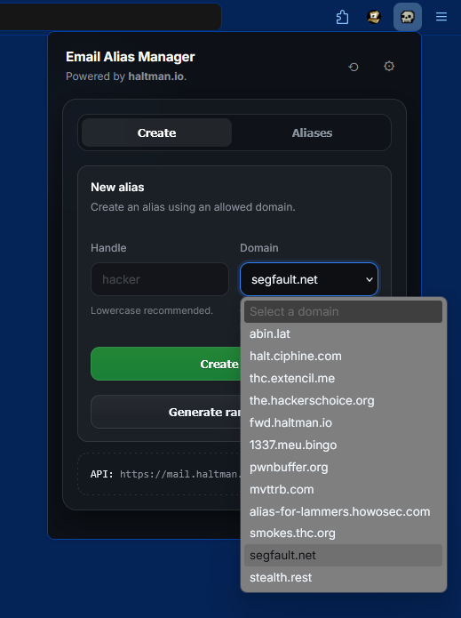
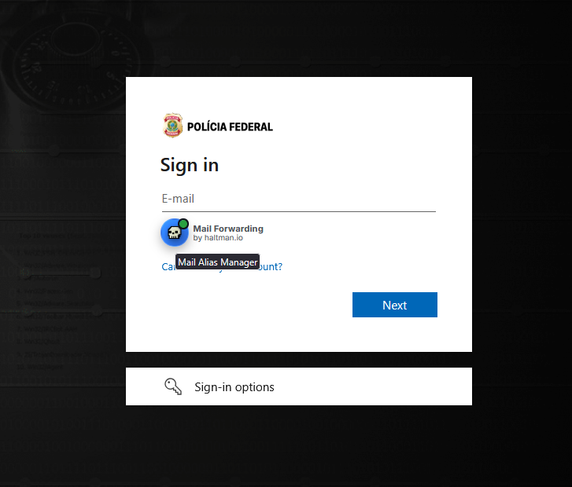
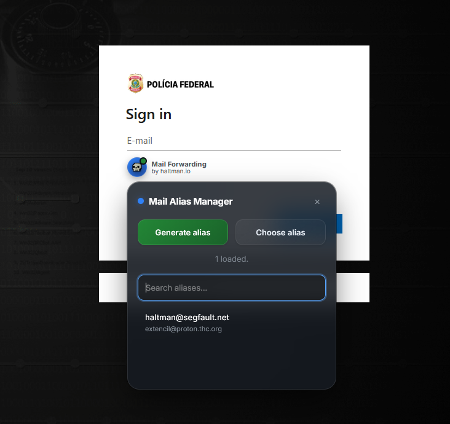
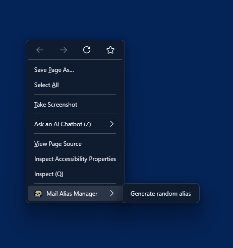
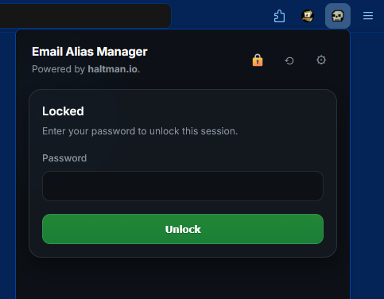

# EMAIL ALIAS MANAGER (FREE)
## Firefox edition – no gods, no masters.

Welcome to the Email Alias Manager.
Yeah, another browser extension.
No, it’s not spyware.
No, it’s not “freemium”.
No, we’re not here to upsell you shit.

You can **view, create, and delete mail aliases** using your own API key.
Generate it yourself at:
👉 https://forward.haltman.io/

No sign-up circus.
No marketing funnels.
No “AI-powered synergy”.
Just aliases. Period.

---

## WTF is Haltman.io Mail Forwarding?

A **simple, fast, secure, abuse-aware, open-source mail forwarding stack**.

Read that again. Slowly.

- ❌ No *open-core* scam
- ❌ No artificial limits
- ❌ No “starter plan”
- ❌ No VC parasites

What you get instead:

- ✅ Unlimited domains
- ✅ Unlimited users
- ✅ Unlimited addresses
- ✅ Your infra, your rules

Run it. Fork it. Break it. Fix it.
That’s how this shit is supposed to work.

---

## Why does this even exist?

Because everything else out there **sucks**.

We looked.
Hard.

What we found was a landfill of SaaS trash. “It’s open-source, BUT…”: 
> YoU CaN OnLy hAvE **1 AliaS**
> pAy uS To uNlOcK ThE ReSt
> UpLoAd yOuR StUdEnT Id tO OuR ToTaLlY-NoT-CoMpRoMiSeD InFrA  
> fReE TrIaL If yOu bEg nIcElY AnD GiVe uS YoUr dAtA  
> EnTeRpRiSe pLaN If yOu eNjOy bEiNg rObBeD  

Same old bullshit.
Different landing page.

So we said: **fuck it**.

We built our own, using tools we actually trust and have been abusing for decades:

- Postfix
- MariaDB
- OpenDKIM
- Real servers
- Real configs
- Real control

No more fake “privacy-first” lies.

---

## Philosophy

This project is our **collective middle finger 🖕**
to anyone who thinks they get to decide:

- how many aliases you’re allowed to have
- what you can run on *your* infrastructure
- how much “freedom” costs per month

You don’t like it?
Good.
Audit the code.
Fix it.
Fork it.
Or go back to your SaaS prison.

---

## Screenshots (because people still ask)

Yes, it works.
Yes, it’s boring.
That’s the point.

---

## FAQ (aka: dumb questions answered once)

**Q: Why isn’t this listed on the AMO (Addons[.]Mozilla[.]Org)?**  
**A:** Because ~~Google~~ Mozilla (joking) moves at the speed of a dying mainframe.

Also:
- The source code is right here.
- Read it.
- Audit it.
- If you don’t trust it, don’t install it.

No mystery blobs.
No obfuscation.
No “trust us bro”.

---

## Final words

This is not a product.
This is not a startup.
This is not a brand.

It’s a tool.
Use it.

If this README offends you:
👉 mission accomplished 😘

## Greetings to hackerschoice

Massive thanks to **The Hacker's Choice** (THC) for adding and trusting the following domains:

- `smokes.thc.org`
- `segfault.net`

Both are now live and wired into the stack — clean, fast, no bullshit.

Extra respect for running your **own UI** at:  
👉 https://mail.thc.org  

No middlemen.  
No SaaS leashes.  
No corporate clownery.

Just hackers doing hacker things, the way it’s been done since before “cloud” meant someone else’s computer.

— EOF

