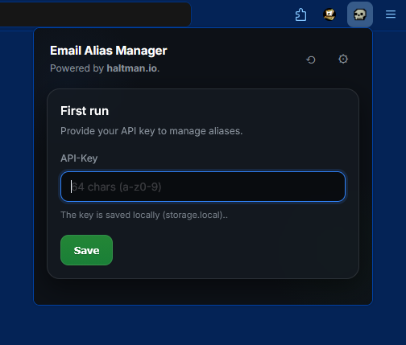
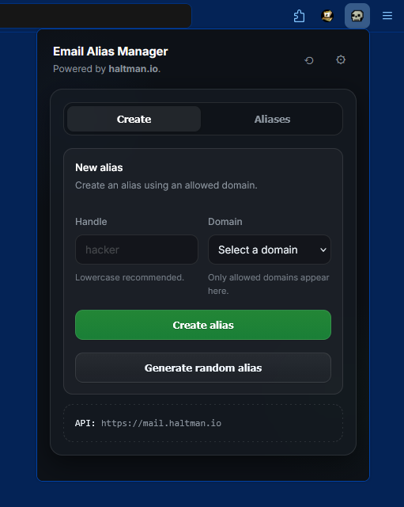
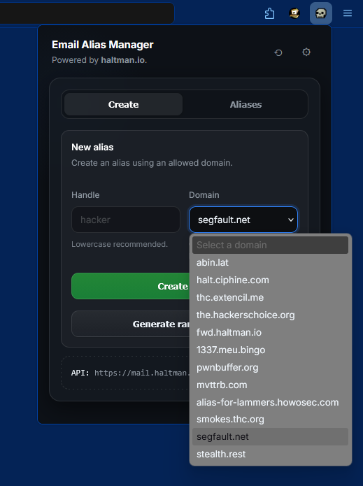
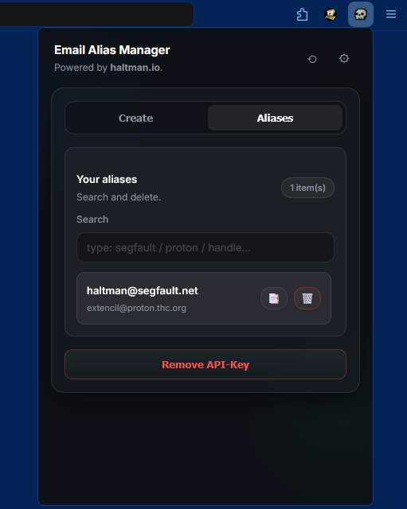
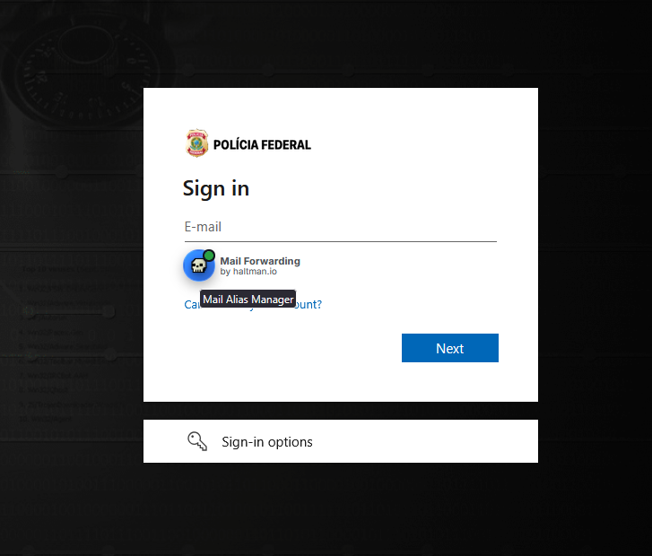
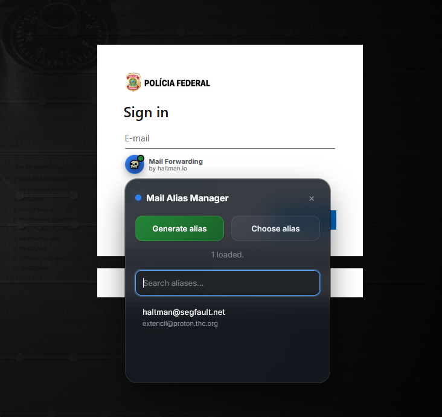
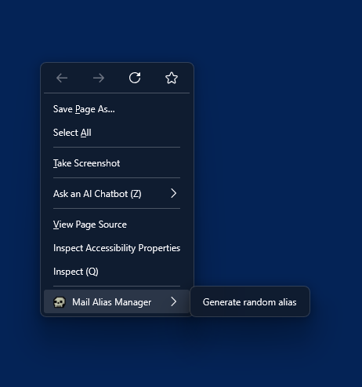
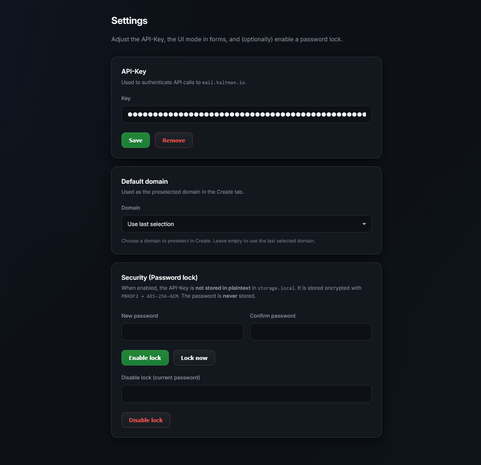
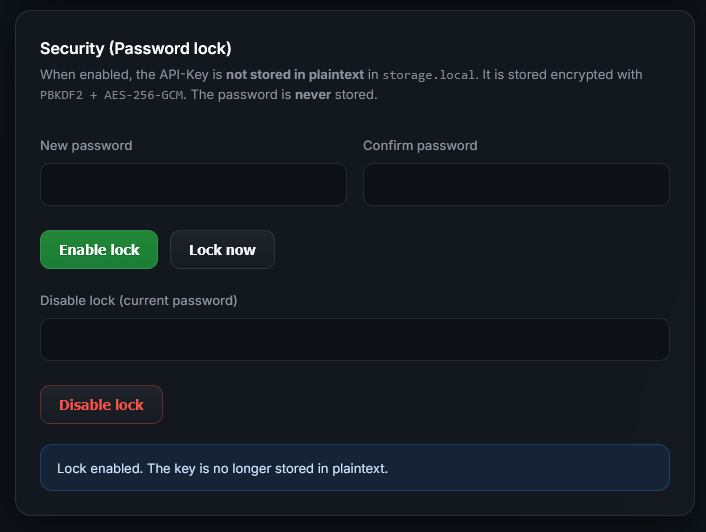
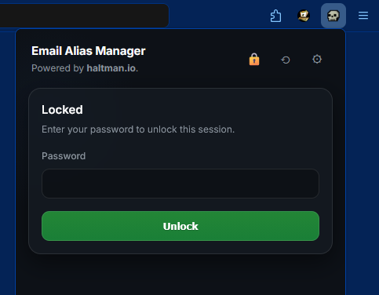

<h1 align="center">Email Alias Manager (Free) — Firefox edition</h1>

<p align="center">
  View, create, and delete email aliases on
  <a href="https://mail.haltman.io">Haltman.io Mail Forwarding</a>
  directly from Firefox.<br>
  No account. No telemetry. No lock-in. Just aliases.
</p>

<p align="center">
  <a href="https://addons.mozilla.org/en-US/firefox/addon/email-alias-manager/"></a>
  
  
  
</p>

<p align="center">
  Trusted by
  <a href="http://phrack.org"><strong>Phrack</strong></a> ·
  <a href="https://www.thc.org"><strong>The Hacker's Choice</strong></a> ·
  <strong>Team TESO</strong> ·
  <strong>EuroCompton</strong> ·
  <strong>AntiSec</strong>
</p>

<p align="center">
  <sub>No gods. No masters. No VC. No tiers.</sub>
</p>

---

## Table of contents

- [What is this?](#what-is-this)
- [Features](#features)
- [Screenshots](#screenshots)
- [Install](#install)
  - [From the Firefox Add-ons store](#from-the-firefox-add-ons-store)
  - [From source (temporary install)](#from-source-temporary-install)
- [Getting an API key](#getting-an-api-key)
- [Usage](#usage)
  - [Popup](#popup)
  - [In-page overlay](#in-page-overlay)
  - [Context menu](#context-menu)
  - [Options](#options)
- [Supported domains](#supported-domains)
- [Permissions](#permissions)
- [Privacy](#privacy)
- [Architecture](#architecture)
- [Development](#development)
- [Trusted by](#trusted-by)
- [Security &amp; abuse reports](#security--abuse-reports)
- [Contributing](#contributing)
- [License](#license)
- [Credits](#credits)

---

## What is this?

**Email Alias Manager** is a Firefox add-on for [Haltman.io Mail Forwarding](https://mail.haltman.io) — a free, open-source, self-hostable, abuse-aware mail forwarding stack maintained by the Haltman.io collective in cooperation with [The Hacker's Choice (THC)](https://www.thc.org).

Give every service a different address. If one leaks, burn that alias. Your real inbox stays yours.

The add-on talks to **one** backend — `https://mail.haltman.io` — and nothing else. No analytics, no telemetry, no third-party SDKs. Source is public, license is [Unlicense](./LICENSE).

## Features

- **51 domains** — pick from the full domain pool, including `reads.phrack.org`, `smokes.thc.org`, `free.team-teso.net`, `segfault.net`, and more.
- **Generate** — random readable handles (`blue.forest`), random cryptographic handles (`k7p3x9m2`), or fully custom handles with live validation.
- **Insert into email fields** — a minimal, CSS-isolated overlay renders next to any `input[type="email"]`. Pick *Generate* or *Choose* and the alias is inserted.
- **Right-click context menu** — `Email Alias Manager → Generate random alias` creates an alias and copies it to the clipboard.
- **Browse and manage** — search, copy, or delete your aliases from the popup with keyboard and pointer controls.
- **Domain controls** — set a default domain, mark favorites, and remember the last one used.
- **Overlay scope** — show the helper on all sites, only on an allowlist, or everywhere except a denylist. One-click *Disable on this site*.
- **Password lock** — optional local lock. Your API key is encrypted at rest with **PBKDF2 (SHA-256)** + **AES-256-GCM**. The password is never stored.
- **Request a new key from the popup** — email-based credential flow with anti-abuse confirmation (no account required).
- **No tracking** — no analytics, no remote scripts, no third-party hosts. Verifiable from the source.

## Screenshots

<p align="center">
  <br>
  <em>First run — paste an existing key, or request a new one by email.</em>
</p>

<p align="center">
  
  
</p>

<p align="center">
  <br>
  <em>Choose — search, copy, and delete aliases.</em>
</p>

<p align="center">
  
  
</p>

<p align="center">
  <br>
  <em>Right-click anywhere — <code>Generate random alias</code>.</em>
</p>

<p align="center">
  
  
</p>

<p align="center">
  <br>
  <em>Optional password lock.</em>
</p>

## Install

### From the Firefox Add-ons store

1. Open [addons.mozilla.org/en-US/firefox/addon/email-alias-manager](https://addons.mozilla.org/en-US/firefox/addon/email-alias-manager/).
2. Click **Add to Firefox**.
3. Open the toolbar popup and connect an API key (see [Getting an API key](#getting-an-api-key)).

### From source (temporary install)

For auditing, review, or running an unreleased build.

```bash
git clone https://github.com/haltman-io/mail-forwarding-addon-mozilla-firefox.git
cd mail-forwarding-addon-mozilla-firefox
```

Then:

1. Open `about:debugging#/runtime/this-firefox`.
2. Click **Load Temporary Add-on…**.
3. Select `source/manifest.json`.

The add-on stays installed until Firefox restarts. For a persistent install, use AMO.

Optional — produce a zipped artifact you can drag into `about:addons`:

```bash
cd source && zip -r ../mail-forwarding-addon-mozilla-firefox.xpi . -x "*.DS_Store"
```

## Getting an API key

You have three options. All three land on the same Haltman.io backend.

### 1. Directly from the extension (easiest)

Open the popup, scroll down to **Request a new key**, enter your email, pick a validity (1–90 days), and click **Request API key**. Check your inbox for a confirmation and then paste the returned token in the **Paste your API key** field.

### 2. From the web UI

Go to [mail.thc.org](https://mail.thc.org) or [forward.haltman.io](https://forward.haltman.io), pick a handle/domain/destination, confirm the 6-digit token emailed to you. Request an API key from the same UI when you want programmatic access.

### 3. From the terminal

```bash
# 1) Request a token
curl -s -X POST 'https://mail.haltman.io/api/credentials/create' \
     -H 'Content-Type: application/json' \
     -d '{"email":"you@example.com","days":30}'

# 2) Check your inbox, then confirm. The response contains your API key.
curl -s 'https://mail.haltman.io/api/credentials/confirm?token=123456'
```

The API key is 64 lowercase hex characters. It is **shown once** and stored server-side as a SHA-256 hash — write it down somewhere safe (a password manager is ideal).

## Usage

### Popup

- **Generate** — pick a domain, press **Generate & Copy**. The alias is created on the server and copied to your clipboard.
- **More options** — choose *Readable words* or *Random*, or enter a fully custom handle with live validation.
- **Choose** — browse, search, copy, or delete your existing aliases.
- **Password lock** — if enabled, click the 🔒 icon to lock the session immediately.

### In-page overlay

On any page with an `<input type="email">`, a small helper appears next to the field (icon mode) or a pill group (buttons mode). Click it to open a card:

- **Generate & insert** — creates a new alias and inserts it into the field.
- **Choose existing** — search and insert one of your aliases.
- **Disable on this site** — adds the current site to your denylist.

The overlay:

- renders inside a Shadow DOM so site CSS can't leak in and vice versa,
- never reads the field's existing value,
- never transmits the current URL or page content to the backend.

### Context menu

Right-click anywhere → **Email Alias Manager → Generate random alias**.

Creates a `word1.word2@<random-domain>` alias, copies it to the clipboard, and shows a notification.

### Options

Open with the ⚙️ button in the popup, or via `about:addons` → **Email Alias Manager → Preferences**.

- **API key** — view, replace, or remove the stored key.
- **Default domain** — preselect your favorite domain in the popup.
- **Input overlay** — toggle globally, or restrict to an allowlist / denylist of sites (hosts, URLs, or `file://`).
- **Password lock** — enable, lock now, or disable. Uses PBKDF2 (310k iterations, SHA-256) + AES-256-GCM.
- **Disconnect extension** — wipes all local extension data (aliases on the server are unaffected).

## Supported domains

**51 domains** available at the time of writing. Highlights from the Phrack / THC / TESO / AntiSec / EuroCompton constellation:

| Domain | Scene note |
|---|---|
| `reads.phrack.org` | [Phrack Magazine](http://phrack.org) — the original hacking e-zine |
| `smokes.thc.org` | [The Hacker's Choice](https://www.thc.org) — since 1995 |
| `free.team-teso.net` | Team TESO — early-2000s exploit research |
| `segfault.net` | general-purpose, disposable |
| `ghetto.eurocompton.net` | oldest IDS enemy |
| `lulz.antisec.net` | AntiSec — you know what it is |

Other entries (`metasploit.io`, `polkit.org`, `cobaltstrike.org`, `johntheripper.org`, …) were publicly available for registration and added to the shared pool; they are **not** affiliated with the original projects.

The full list is discovered at runtime via `GET /api/domains`, cached locally for 24 hours, and shown in the popup's domain picker.

## Permissions

The add-on requests the **minimum** set that makes it work. Every permission maps to a feature you can see:

| Permission | Purpose |
|---|---|
| `storage` | Persist API key, domain cache, and user preferences (`browser.storage.local`). |
| `contextMenus` | Register *Email Alias Manager → Generate random alias*. |
| `activeTab` | Act on the tab where you invoked the extension (context menu, clipboard). |
| `notifications` | Status notifications after *Generate random alias* (success / failure). |
| `clipboardWrite` | Copy newly generated aliases to the clipboard. |
| `<all_urls>` content script | Render the overlay next to `<input type="email">` fields only. |
| `https://mail.haltman.io/*` | Talk to the Haltman.io backend. The **only** host the add-on ever talks to. |

The add-on does **not** request `tabs`, `cookies`, `webRequest`, `webNavigation`, `history`, `bookmarks`, `downloads`, or any broad host permission beyond `mail.haltman.io`.

Firefox's `browser_specific_settings.gecko.data_collection_permissions` flags the API key (authentication info) and the credential-request email (personally identifying info) — the two pieces of user data that ever leave the device. Both only when you explicitly perform those actions.

## Privacy

- [Privacy policy](https://mail.haltman.io/privacy) · [Anti-abuse policy](https://mail.haltman.io/abuse) · [Security policy](https://mail.haltman.io/security)
- The add-on talks to **one** host only: `https://mail.haltman.io` (always over TLS).
- API keys ride in the `X-API-Key` **header**, never in URLs or query strings.
- The add-on **never** reads the value of the email field, transmits browsing history, page content, or any telemetry.
- When the password lock is on, the API key is encrypted at rest with PBKDF2 + AES-256-GCM and only decrypted in memory for the duration of your unlocked session.

See [`privacy-policy.md`](../privacy-policy.md) (the file that mirrors the policy at [mail.haltman.io/privacy](https://mail.haltman.io/privacy)) for the full text.

## Architecture

```
source/
├── manifest.json           Manifest V2
├── background/
│   └── background.js       message bus, context menu, API calls
├── content/
│   ├── content.js          shadow-DOM overlay next to email inputs
│   └── content.css         minimal host-side reset
├── popup/
│   ├── popup.html          onboarding, Generate tab, Choose tab
│   ├── popup.css
│   └── popup.js            ES module, imports from ../lib
├── options/
│   ├── options.html        settings: key, lock, overlay, default domain
│   ├── options.css
│   └── options.js          ES module, imports from ../lib
├── lib/
│   ├── api.js              typed API wrapper
│   ├── crypto.js           PBKDF2 + AES-GCM helpers
│   └── storage.js          browser.storage.local accessors
├── data/
│   └── dictionary.json     readable handle word list
├── icons/
└── image/
```

- **One backend** — every outbound request is `fetch(\`https://mail.haltman.io/api/...\`)`.
- **Endpoints used** — `GET /api/domains`, `GET /api/alias/list`, `POST /api/alias/create`, `POST /api/alias/delete`, `POST /api/credentials/create`.
- **No remote code** — no `<script src>` pointing at a remote origin, no `eval`, no dynamic `Function`. What you load is what runs.
- **Shadow DOM everywhere UI touches the page** — site CSS never hits the overlay, and the overlay never inherits from the page.

## Development

### Prerequisites

- Firefox ≥ 115 (ESR works).
- Optional: [`web-ext`](https://extensionworkshop.com/documentation/develop/web-ext-command-reference/) (`npm i -g web-ext`) for a nicer dev loop.

### Run

```bash
git clone https://github.com/haltman-io/mail-forwarding-addon-mozilla-firefox.git
cd mail-forwarding-addon-mozilla-firefox/source
web-ext run      # auto-reload while you edit
# or: load source/manifest.json via about:debugging
```

### Lint / package

```bash
cd source
web-ext lint
web-ext build    # produces mail-forwarding-addon-mozilla-firefox-<version>.zip
```

### Coding notes

- The `browser.*` API is used directly (Firefox is MV2 native).
- ES modules are used in popup and options (`<script type="module">`); the background is a classic script so it can register top-level listeners without a bundler.
- The overlay uses **Shadow DOM + position: fixed** so host site layout and CSS cannot break or leak into the widget.
- No bundler, no transpile step, no build artifact in tree. Edits to `source/` are live.

## Trusted by

This add-on ships the Haltman.io / THC shared domain pool that is used by — and in some cases hosted by — people you probably already read.

- [**Phrack Magazine**](http://phrack.org) — `reads.phrack.org`
- [**The Hacker's Choice (THC)**](https://www.thc.org) — `smokes.thc.org`
- **Team TESO** — `free.team-teso.net`
- **EuroCompton** — `ghetto.eurocompton.net`
- **AntiSec** — `lulz.antisec.net`
- …and 45+ more.

Huge respect to THC for running [mail.thc.org](https://mail.thc.org) on top of the same stack — no middlemen, no SaaS leashes, no corporate clownery.

## Security & abuse reports

- **Security / VDP** — [mail.haltman.io/security](https://mail.haltman.io/security) (there is a Hall of Fame).
- **Abuse** — [mail.haltman.io/abuse](https://mail.haltman.io/abuse).
- **Direct contact** — `root@haltman.io` and `members@proton.thc.org`.

We do **not** tolerate abuse of the forwarding service — no ransomware, botnets, DDoS, fraud, or harassment infrastructure. If you see abuse, write to us; we will neutralize it.

## Contributing

Issues, PRs, and pull-request conversations are welcome at the [GitHub repository](https://github.com/haltman-io/mail-forwarding-addon-mozilla-firefox).

Before submitting a PR:

- Keep it scoped — small, focused changes land fastest.
- No build steps, no dependencies, no transpilers — if you need to add one, open an issue first.
- Follow the existing style (2-space indent, double quotes, semicolons, strict equality).
- `web-ext lint` must pass.
- Do not add analytics, telemetry, remote hosts, or third-party scripts. Ever.

## License

Released under the [Unlicense](./LICENSE) — public domain, no restrictions, no copyleft, no strings. Fork it, sell it, rebrand it. We don't care.

## Credits

Built by the [**Haltman.io**](https://haltman.io) collective — an independent crew of Brazilian hackers — in cooperation with [**The Hacker's Choice (THC)**](https://www.thc.org).

Foundations we stand on: the original Perl alias API by [Lou-Cipher](https://github.com/lou-cipher) (RIP the service, long live the idea), Postfix, Dovecot, PostSRSd, MariaDB, OpenDKIM, and everyone who kept the mail stack boring enough to still work in 2026.

*Made in Brazil.* 🇧🇷
